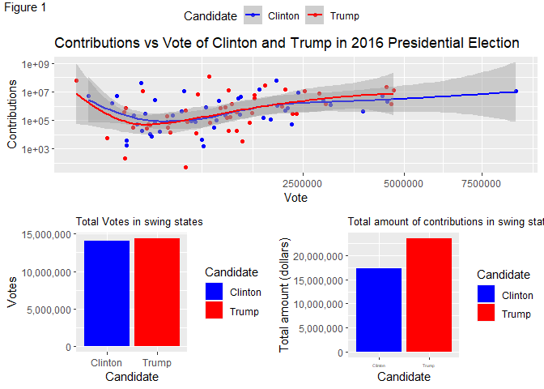
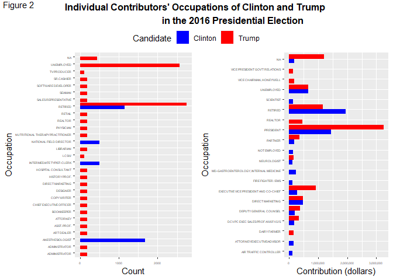

PS07
================

# SDS 192 Mini Project 2: “Follow the Money: Analysis of 2016 Presidential Election”

## Data import

``` r
library(fec16)
library(ggplot2)
library(dplyr)
```

    ## 
    ## Attaching package: 'dplyr'

    ## The following objects are masked from 'package:stats':
    ## 
    ##     filter, lag

    ## The following objects are masked from 'package:base':
    ## 
    ##     intersect, setdiff, setequal, union

``` r
library(ggpubr)
library(tidyverse)
```

    ## -- Attaching packages --------------------------------------- tidyverse 1.3.1 --

    ## v tibble  3.1.4     v purrr   0.3.4
    ## v tidyr   1.1.4     v stringr 1.4.0
    ## v readr   2.0.2     v forcats 0.5.1

    ## -- Conflicts ------------------------------------------ tidyverse_conflicts() --
    ## x dplyr::filter() masks stats::filter()
    ## x dplyr::lag()    masks stats::lag()

``` r
# Download full contributions data from web and overwrite contributions using:
# read_all_*() function.
# You will need to install the usethis package for this line of code to work
contributions <- read_all_contributions()
```

    ## v Downloading from 'https://www.fec.gov/files/bulk-downloads/2016/pas216.zip'

    ## 

    ## v Download stored in 'C:/Users/HP/AppData/Local/Temp/RtmpcPVe3X/pas216.zip'

    ## v Unpacking ZIP file into 'pas216/' (1 files extracted)

    ## v Deleting 'pas216.zip'

    ## Rows: 0 Columns: 22

    ## -- Column specification --------------------------------------------------------
    ## Delimiter: ","
    ## chr (22): CMTE_ID, AMNDT_IND, RPT_TP, TRANSACTION_PGI, IMAGE_NUM, TRANSACTIO...

    ## 
    ## i Use `spec()` to retrieve the full column specification for this data.
    ## i Specify the column types or set `show_col_types = FALSE` to quiet this message.

``` r
expenditures <- read_all_expenditures()
```

    ## v Downloading from 'https://www.fec.gov/files/bulk-downloads/2016/oppexp16.zip'

    ## 

    ## v Download stored in 'C:/Users/HP/AppData/Local/Temp/RtmpcPVe3X/oppexp16.zip'

    ## v Unpacking ZIP file into 'oppexp16/' (1 files extracted)

    ## v Deleting 'oppexp16.zip'

    ## Rows: 0 Columns: 25

    ## -- Column specification --------------------------------------------------------
    ## Delimiter: ","
    ## chr (25): CMTE_ID, AMNDT_IND, RPT_YR, RPT_TP, IMAGE_NUM, LINE_NUM, FORM_TP_C...

    ## 
    ## i Use `spec()` to retrieve the full column specification for this data.
    ## i Specify the column types or set `show_col_types = FALSE` to quiet this message.

``` r
transactions <- read_all_transactions()
```

    ## v Downloading from 'https://www.fec.gov/files/bulk-downloads/2016/oth16.zip'

    ## 

    ## v Download stored in 'C:/Users/HP/AppData/Local/Temp/RtmpcPVe3X/oth16.zip'

    ## v Unpacking ZIP file into 'oth16/' (1 files extracted)

    ## v Deleting 'oth16.zip'

    ## Rows: 0 Columns: 21

    ## -- Column specification --------------------------------------------------------
    ## Delimiter: ","
    ## chr (21): CMTE_ID, AMNDT_IND, RPT_TP, TRANSACTION_PGI, IMAGE_NUM, TRANSACTIO...

    ## 
    ## i Use `spec()` to retrieve the full column specification for this data.
    ## i Specify the column types or set `show_col_types = FALSE` to quiet this message.

## Summary

These visualizations compare firstly how contributions correlate with
the number of votes received by Clinton and Trump in the 2016 election,
and secondly which occupations contributed the most. Trump gained more
votes and contributions in swing states, which corresponds to the 2016
election result. We also found a weak correlation between votes and
contribution. Occupations of each candidate’s individual contributors
reveal that since Trump attracted a larger number of unemployed people’s
contribution and a larger amount of presidents’ contributions, while
Clinton’s contributors did not contribute as much as Trump’s, Trump was
thus more advantageous and won the 2016 election.

# Votes vs Contribution of Clinton and Trump

From the top graph in the figure 1, we can see a weak correlation
between the contribution and the total amount of votes in the 2016
presidential election. Namely, if a candidate gained more votes, then
probably the contribution of this candidate would be high too. Since
Trump won the 2016 election, we would hypothesize that Trump gained both
more votes and contributions in important areas based on the former
graph. Therefore, we look at the total number of votes and total amount
of contribution in the swing states [1], which largely determines who
would win in the end, for both final candidates. As we can see on the
bottom two graphs, Trump gained more on both contribution and votes in
swing states, which matched the result. Especially, Trump gained almost
25% more contribution in the swing states. We thus wonder why Trump
gained more money, specifically what kind of people were contributing to
each candidate in the 2016 election, which is discussed in the second
visualization in Figure 2.

``` r
#Clinton id: P00003392
#Trump id: P80001571

transaction_amt_C_T <- contributions %>% 
  filter(cand_id == "P00003392" | cand_id == "P80001571") %>% 
  inner_join(candidates, by = "cand_id") %>% 
  group_by(state, cand_id) %>% 
  filter(state == "AZ" | state == "CO" | state == "FL" | state == "GA" | 
           state == "IA" | state == "MI" | state == "MN" | state == "NV"  | 
           state == "NH" ) %>% 
  summarise(amt = sum(transaction_amt)) %>% 
  mutate(Candidate = ifelse(cand_id == "P00003392", "Clinton", "Trump"))
```

    ## `summarise()` has grouped output by 'state'. You can override using the `.groups` argument.

``` r
Votes <- results_president %>% 
  filter(cand_id ==  "P00003392" | cand_id == "P80001571") %>% 
  mutate(Candidate = ifelse(cand_id == "P00003392", "Clinton", "Trump")) %>% 
  group_by(Candidate, state) %>% 
  filter(state == "AZ" | state == "CO" | state == "FL" | state == "GA" | 
           state == "IA" | state == "MI" | state == "MN" | state == "NV"  | 
           state == "NH" ) %>% 
  summarise(Vote = sum(general_votes))
```

    ## `summarise()` has grouped output by 'Candidate'. You can override using the `.groups` argument.

``` r
votes <- ggplot(Votes, aes(x = Candidate, y = Vote, fill = Candidate)) +
  geom_col() +
  #facet_wrap(~state) +
  scale_fill_manual(values = c("blue", "red")) + 
  labs(title = "Total Votes in swing states",
       y = "Votes")+
  theme(plot.title = element_text(size = 10))+
  scale_y_continuous(labels = scales::comma)

Vcontribution<-ggplot(transaction_amt_C_T, aes(x = Candidate, 
                                               y = amt, 
                                               fill = Candidate)) + 
  geom_col() +
  theme(axis.text.x = element_text(size = 4)) +
  scale_fill_manual(values = c("blue","red")) +
  labs(title = "Total amount of contributions in swing states ", 
       y = "Total amount (dollars)")+
  theme(plot.title = element_text(size=10))+
  scale_y_continuous(labels = scales::comma)


C_T <- candidates %>% 
  filter(cand_id == "P00003392" | cand_id == "P80001571")

results_C_T <- results_president %>%
  filter(cand_id == "P00003392" | cand_id == "P80001571") %>% 
  select(cand_id, state, general_votes, general_percent) %>% 
  arrange(cand_id)
 
contributions_C_T <- contributions %>% 
  filter(cand_id == "P00003392" | cand_id == "P80001571") %>% 
  group_by(cand_id, state) %>% 
  summarise(amt = sum(transaction_amt)) %>% 
  arrange(cand_id)
```

    ## `summarise()` has grouped output by 'cand_id'. You can override using the `.groups` argument.

``` r
results_and_contribution_C_T <- results_C_T %>% 
  inner_join(contributions_C_T, by = c("state", "cand_id")) %>% 
  inner_join(C_T %>% select(cand_id, cand_name), by="cand_id") %>% 
  mutate(Candidate = ifelse(cand_id == "P00003392", "Clinton", "Trump")) 

VS<-ggplot(results_and_contribution_C_T, aes(x = general_votes, 
                                         y = amt, 
                                         color = Candidate)) +
  geom_point() +
  geom_smooth() +
  scale_y_log10() +
  scale_x_sqrt() +
  labs(title = "Contributions vs Vote of Clinton and Trump in 2016 Presidential Election",
       x = "Vote",
       y = "Contributions") +
  scale_color_manual(values = c("blue","red")) 
  

figure1<-ggarrange(VS, 
          ggarrange(votes, Vcontribution, ncol = 2), 
          nrow = 2,
          common.legend = TRUE)
```

    ## `geom_smooth()` using method = 'loess' and formula 'y ~ x'

    ## Warning: Removed 2 rows containing non-finite values (stat_smooth).

    ## Warning: Removed 2 rows containing missing values (geom_point).

    ## `geom_smooth()` using method = 'loess' and formula 'y ~ x'

    ## Warning: Removed 2 rows containing non-finite values (stat_smooth).

    ## Warning: Removed 2 rows containing missing values (geom_point).

``` r
annotate_figure(figure1, fig.lab = "Figure 1")
```

<!-- -->

## Individual contributors’ occupations for Clinton and Trump

The graph on the left shows the groups with the most individual
contributors, regardless of how much money those individuals donated. A
group is defined by occupation and party. The graph on the right shows
the groups with the greatest total amount of money contributed. We can
see that Trump received money from significantly more individuals than
Clinton, but the margin between them for the total amount of money
received was much smaller. This suggests that each person who
contributed to Trump may have given a smaller amount of money on
average.

The only main contributing occupations for which Clinton has more
individual supporters than Trump are anesthesiologist, clerk, and
national field director.

Both parties are influenced heavily by money given by presidents, but
presidents are very few individuals who do not appear on the count
graph. The second biggest monetary contributor is retired people, who
also make up a significant number of individuals. This may indicate that
an older demographic tends to be the most active in donating to
elections.

Those who are unemployed also have a surprisingly large number of
contributors and amount of contributions. Those who are unemployed
contributed nearly equal amounts of money to both parties, but Trump
received money from far more unemployed individuals. This may say
something about the reasons for unemployment for individuals for each
party; Trump has a much larger number of unemployed supporters who
contributed small amounts of money, while Clinton has few unemployed
supporters who each gave a larger amount.

``` r
individuals2 <- individuals %>% 
  select(occupation, cmte_id, transaction_amt, tran_id)

candidates2 <- candidates %>% 
  select(cand_id, cand_pty_affiliation)

contributions2 <- contributions %>% 
  select(cmte_id, cand_id) %>% 
  inner_join(individuals2, by = "cmte_id") %>% 
  inner_join(candidates2, by = "cand_id") %>% 
  group_by(occupation, cand_pty_affiliation) %>% 
  summarize(total = sum(transaction_amt)) %>% 
  filter(cand_pty_affiliation == "DEM" | cand_pty_affiliation == "REP") %>% 
  arrange(desc(total)) %>% 
  head(30)
```

    ## `summarise()` has grouped output by 'occupation'. You can override using the `.groups` argument.

``` r
occupations<-contributions %>% 
  select(cmte_id, cand_id) %>% 
  inner_join(individuals2, by = "cmte_id") %>% 
  inner_join(candidates2, by = "cand_id") %>% 
  filter(cand_id == "P00003392" | cand_id == "P80001571") %>% 
  group_by(cand_id, occupation) %>% 
  summarise(count = n()) %>% 
  mutate(Candidate = ifelse(cand_id == "P00003392", "Clinton", "Trump")) %>% 
  arrange(desc(count)) %>% 
  head(30)
```

    ## `summarise()` has grouped output by 'cand_id'. You can override using the `.groups` argument.

``` r
occupation_by_count<-ggplot(occupations, aes(x = occupation, 
                                             y = count, 
                                             fill = Candidate)) +
  geom_col(position = position_dodge(preserve = "single")) +
  theme(axis.text.x = element_text(size = 4),
        axis.text.y = element_text(size = 4)) +
  scale_fill_manual(values = c("blue","red")) +
  labs(x = "Occupation", y = "Count")+coord_flip()

occupation_by_amt<-ggplot(data = contributions2, 
                          mapping = aes(x = occupation, 
                                        y = total, 
                                        fill = cand_pty_affiliation)) +
  geom_col(position = position_dodge(preserve = "single")) +
  theme(axis.text.x = element_text(size = 4),
        axis.text.y = element_text(size = 4))+
  scale_fill_manual(values = c("blue","red"))+
  scale_y_continuous(labels = scales::comma) +
  labs(x = "Occupation", y = "Contribution (dollars)")+coord_flip()

figure2 <- ggarrange(occupation_by_count, occupation_by_amt,
                    ncol = 2, 
                    common.legend=TRUE)
annotate_figure(figure2, 
               top = text_grob("Individual Contributors' Occupations of Clinton and Trump 
                               in the 2016 Presidential Election", 
                               face = "bold"),
               fig.lab = "Figure 2")
```

<!-- -->

[1] <https://en.wikipedia.org/wiki/Swing_state>
